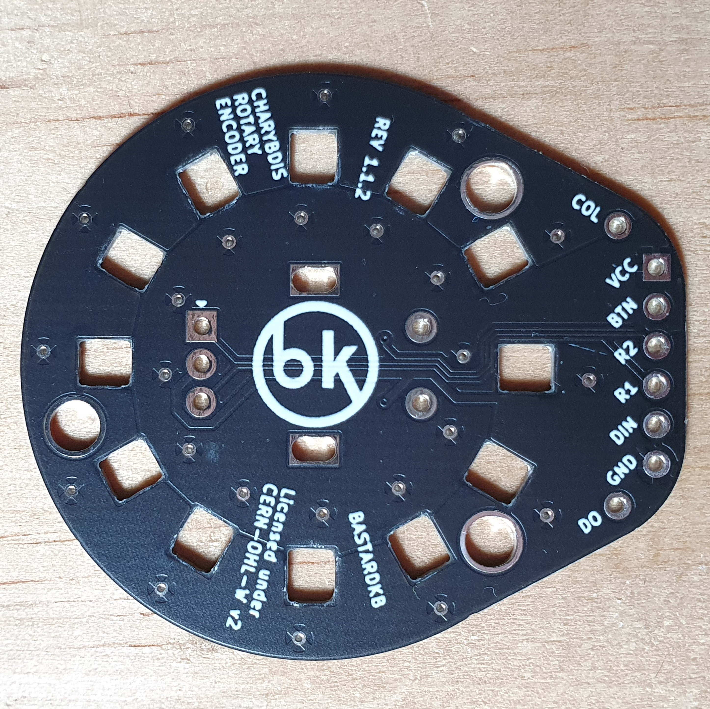
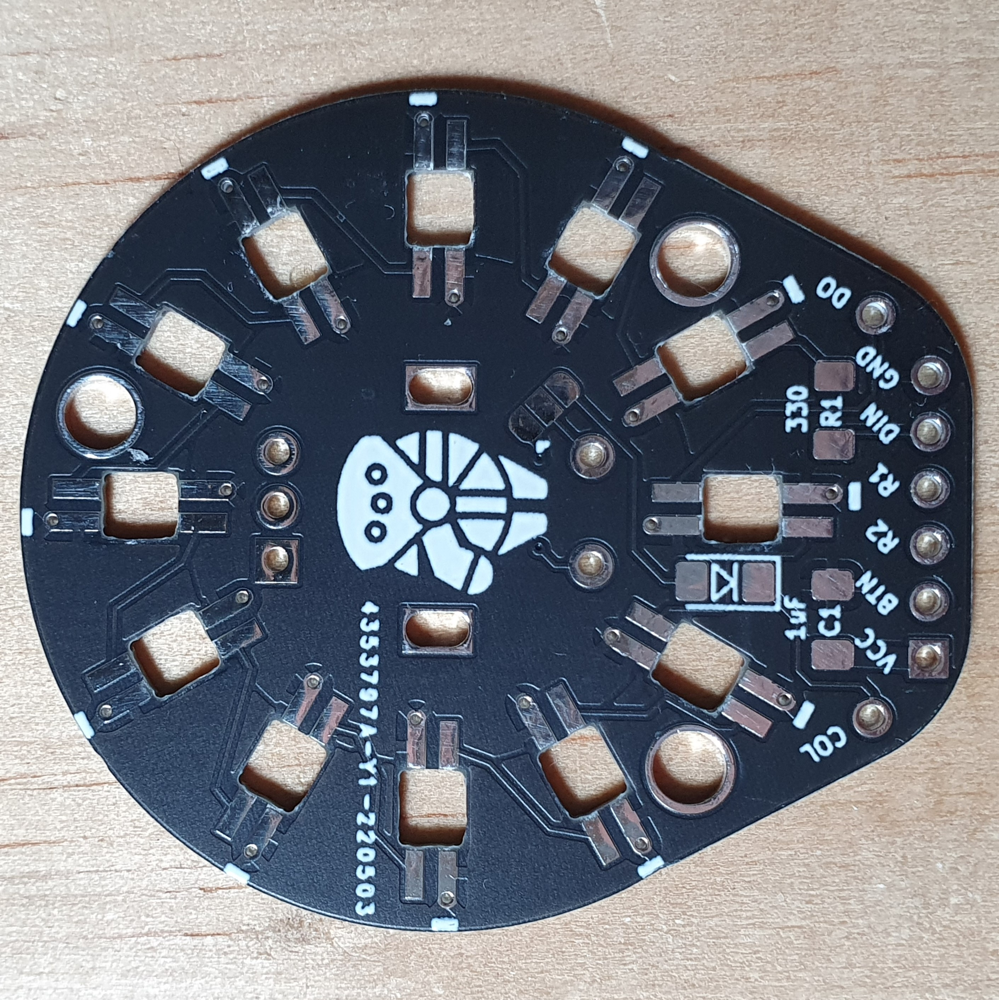

# Charybdis EC11 PCB

EC11 PCB to be used in place of the trackball in the Charybdis keyboard.

`REV 1.2` is tested and working. 

 

## EC11 Encoder
R1 and R2 pins are used for the encoder rotation pulses, these should be connected to unused pins on the microcontroller. The MOSI/MISO/SCLK/CS will be the most convenient - any two of these can be used.

For normal configuration of the pushbutton function with the Charybdis:
 - Bridge the 2 unmarked pads on the solder jumper
 - install a SOD-123 diode in the marked footprint
 - connect Col to a column and BTN to a row that corresponds with the missing thumb key matrix position

If your keyboard uses direct pin you will need to bridge the middle pad on the solder jumper with the marked pad. BTN should then be connected to a free GPIO pin on your microcontroller.

## LEDs
LEDs are optional. If not being used, VCC, GND, DIN, and DO can be ignored.

Otherwise:
- Install a capacitor and resistor on the marked footprints (this should be the same as the
- VCC and GND can be connected to wherever is the most convenient
- DIN and DO should be connected as part of the existing LED chain on the half - the suggested way to do this is to connect the DO from the PCB plate to the EC11 adapter DIN (instead of the thumb cluster), and the thumb cluster pcb DIN to the EC11 adapter DO

## Misc. Note
It should be possible to connect the adapter directly to the 6 pins of the trackball pin header on the shield for better aesthetics and modularity. However this would need custom matrix scanning code - to mix direct pin and switch matrix scanning, as well as a custom RGB LED driver to allow a second `RGB_DI` pin to be defined

Licensed under CERN-OHL-W v2.

Copyright Quentin Lebastard 2022.